Automated Hosting Information Hunting Tool

<div align="">   </div>

### 功能特性

- 支持自动化一键 Hunting 主机各类关键信息和凭据，降低后渗透阶段操作的割裂感，有效拓宽后渗透攻击面
- 支持参数化执行特定模块，例如只获取 RDP 连接信息、特定软件凭据，或通过 Post 模块截图、执行 Shellcode
- 借助 C# 的底层能力通过代码和 API 实现各类主机信息收集命令，降低攻防中各类马的动态行为特征
- 获取最新版本的 WeChat、Chromium 系列、MobaXterm、ToDesk、SunLogin 等各类软件凭据获取和解密
- 保留必要的异常抛出的同时内置大量提示信息，方便攻击者知晓 Hunting 失败原因，不遗漏关键信息的获取

> 详情见分享议题：https://xz.aliyun.com/t/16823

### 可选参数

```shell
[*] Usage: SharpHunter [command] [options]

  Info Commands:
    all       - Hunt all informations and credentials.
    sys       - Collect basic system information.
    pid       - List and mark running processes.
    net       - Display network connection details.
    rdp       - Check RDP settings and connection history.
    soft      - List all installed software.
    file      - Gather information about user files.
    domain    - Enumerating Active Directory environments.

  Cred Commands:
    chrome    - Extract credentials from Chromium-based browsers.
    fshell    - Retrieve passwords saved by FinalShell.
    moba      - Extract MobaXterm credentials and passwords.
    todesk    - Hunt credentials from ToDesk process.
    sunlogin  - Hunt credentials from SunloginClient process.
    wechat    - Extract WeChatKey from the WeChat process.
    wifi      - Retrieve Wi-Fi SSIDs and passwords.

  Post Commands:
    run       - Execute commands using the current thread token.
    screen    - Capture a full-screen screenshot of all displays.
    adduser   - Add an administrator account for remote access.
    enrdp     - Enable RDP and create an administrator RDP user.
    down      - Download files remotely from the target server.

  Options:
    -log      - Enable logging.
    -zip      - Enable log compression.
```

### 功能模块

- Info 模块：获取系统信息、网络信息、已安装软件、RDP 状态历史连接信息、 Wi-Fi 密码、桌面文件信息等
- Cred 模块：常见浏览器、服务器管理、数据库管理、即时通讯、IT 运维开发等各类软件凭据及敏感信息获取
- Post 模块：一些常用的后渗透功能如不依赖 cmd.exe 执行系统命令并回显、全荧幕截图、添加管理员用户等
- Ldap 模块：判断主机是否在域环境、定位域控制器、通过 LDAP Filter 枚举域内风险，支持自定义语句查询
- Code 模块：加密 Shellcode、通过指定方式加载 Shellcode，支持远程加载 Donut 转换后的 C#/C/C++ 程序

### 免责声明

**本项目仅适用于安全研究及合法的企业安全建设行为 一切后果及责任均由使用者本人承担**

### 使用

BOF 方式执行：下载 [Release](https://github.com/lintstar/SharpHunter/releases) 中 GitHub Action 自动构建的 SharpHunterBOF.zip

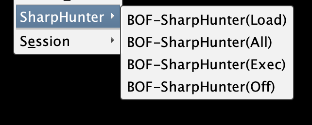

非严苛终端对抗可通过 C2 内置 Assembly 功能执行

```shell
execute-assembly <path>/SharpHunter.exe all -zip
```

### Hunting ALL

最小单元 Check 所有 Info 和 Cred 模块，获取主机信息及凭据

```shell
SharpHunter.exe all -zip
```

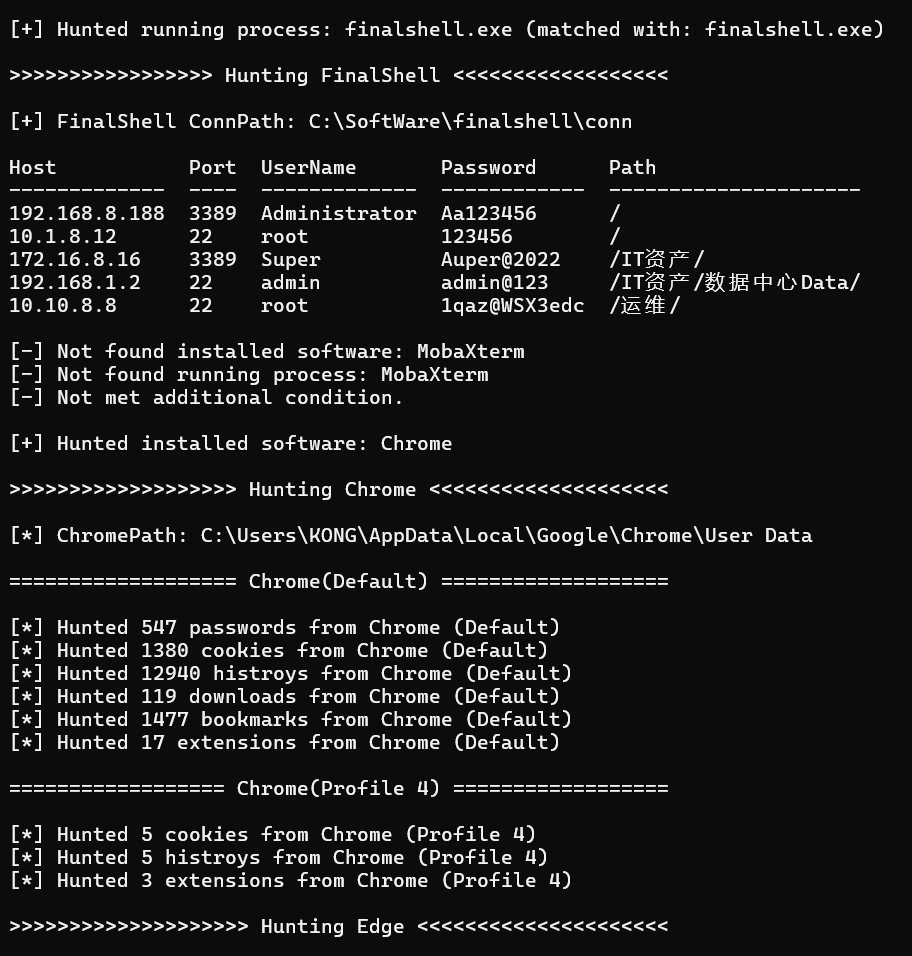

狩猎完成后 log 及浏览器凭据写入 zip 文件

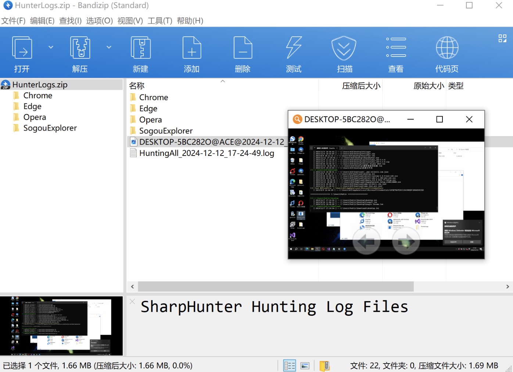

### Discussion

后续建议和反馈欢迎加群：


### Info Mode

#### SystemInfo

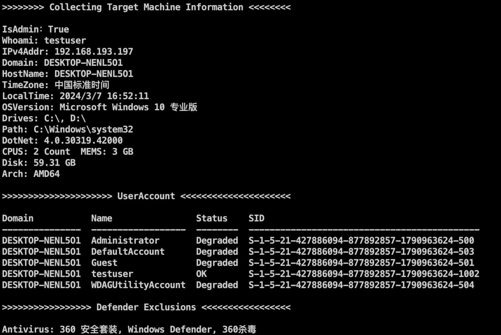

#### Windows Defender Exclusions

包含主机杀软以及当前已经生效的 Windows Defender 排除项，方便进一步做权限维持工作

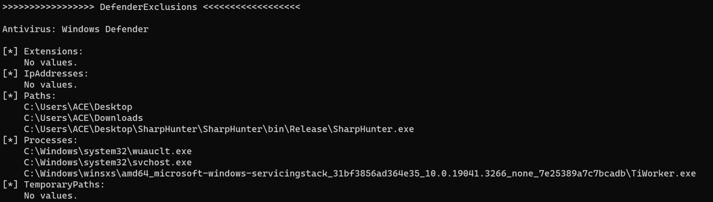

#### Marked Process

标记主机运行进程（Hunting All 模式会输出 csv 文件）

```shell
>>>>>>>>>>>>>>>>>>> Marked Process <<<<<<<<<<<<<<<<<<<<

ProcessName            PID    Arch  Note                                  
---------------------  -----  ----  --------------------------------------
chrome.exe             9712   x64   Google Chrome                                             
HipsDaemon.exe         9632   x86   火绒                                  
prl_cc.exe             6556   x64   Parallels Desktop 虚拟机【虚拟机程序】
prl_tools.exe          3692   x64   Parallels Tools【虚拟机程序】         
prl_tools_service.exe  3512   x64   Parallels Tools【虚拟机程序】         
regedit.exe            224    x64   疑似杀软进程                          
smartscreen.exe        6788   x64   Windows Defender                      
spoolsv.exe            2684   x64   打印机驱动程序                        
usysdiag.exe           6916   x64   火绒
```

#### RDPInfo

RDP 服务相关信息，方便进一步横向移动以及定位运维机器

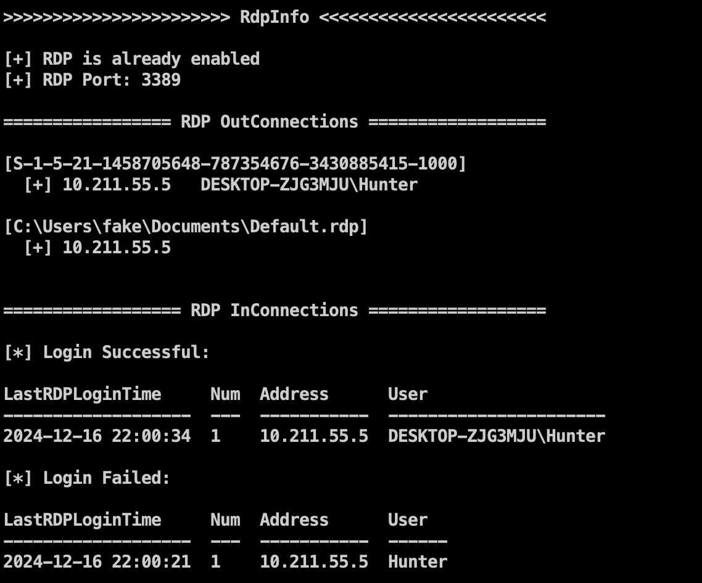

#### SoftInfo

主机已安装软件及版本、安装位置信息

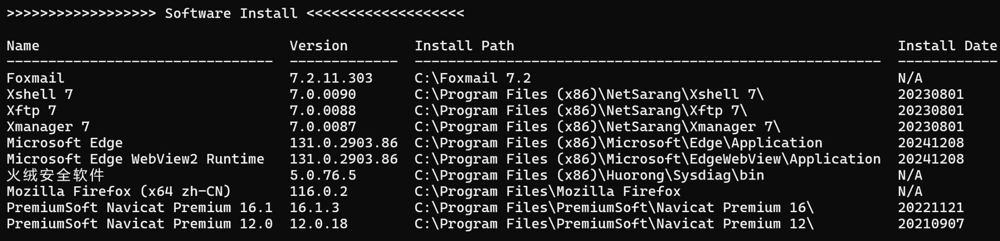

#### UserFileInfo

用户 HostsFile、RecentFile 以及 Desktop 和 Downloads 文件夹信息

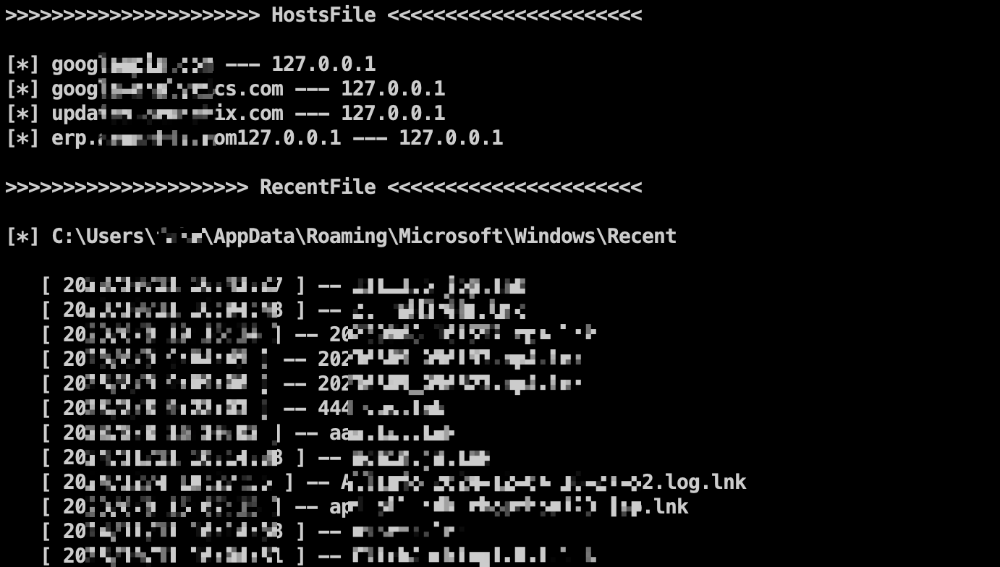

#### DomainInfo

主要包含（部分未更新）：

- 域信息、域 SID 值、每个域唯一的 `ms-DS-MachineAccountQuota` 值
- 是否存在父子域、域控FQDN / IP地址/ 操作系统版本
- AdminSDHolder、KerberoastableUsers、UsersWithoutKerberosPreAuth
- DelegationAccounts、RBCDAccounts、UnconstrainedDelegationComputers
- ADCS、Exchange、SCCM 等域内攻击面

后续版本更新针对大型域的枚举方式：① 初始快速评估 ② 进一步更彻底地分组枚举

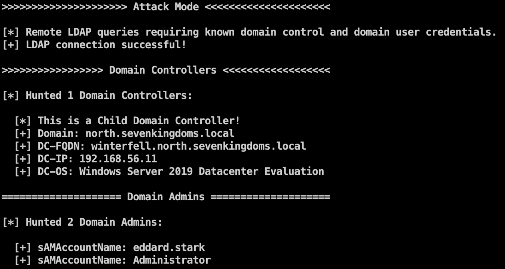

### Cred Mode

#### 浏览器

Chromium 系列浏览器 Cookie V20 版本解密，多用户配置导出密码、书签、访问记录、下载记录等信息

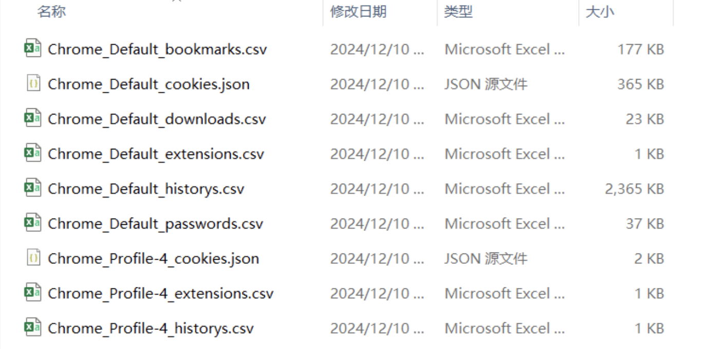

#### WechatKey

根据数据结构相对偏移获取 WechatKey、wxid、PhoneNum 等信息

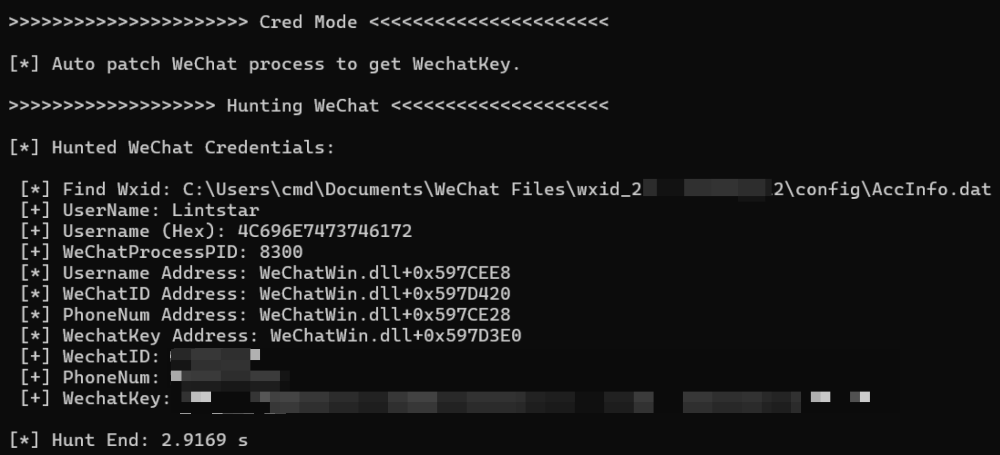

#### MobaXterm

支持安装版、便携版等 6 种场景解密，可提供自定义 `MobaXterm.ini` 路径

```shell
SharpHunter.exe moba C:\Users\ACE\AppData\Roaming\MobaXterm\MobaXterm.ini
```

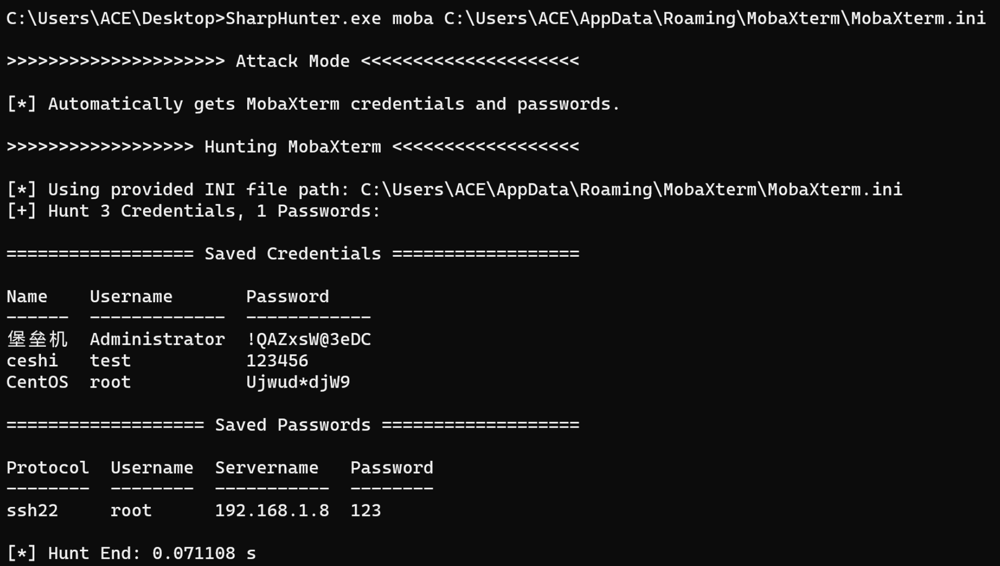

#### FinalShell

支持解密并保留用户配置文件夹信息

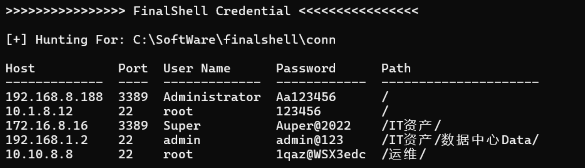

#### ToDesk

获取 ToDesk 登录账户信息、临时密码、安全密码以及密码安全策略

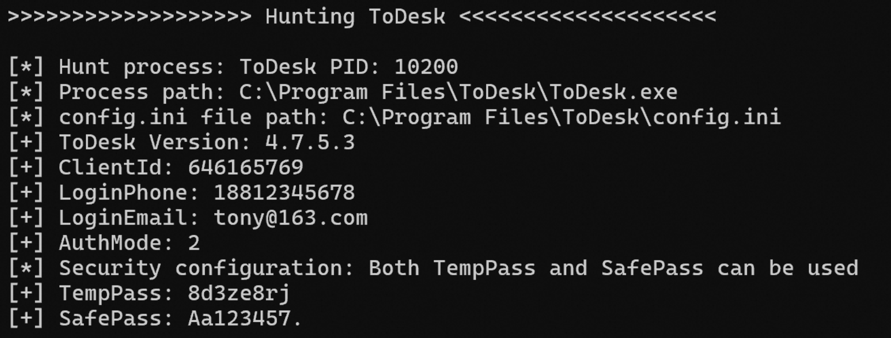

#### SunLogin

获取 SunLogin 登录账户信息、历史密码以及密码安全策略

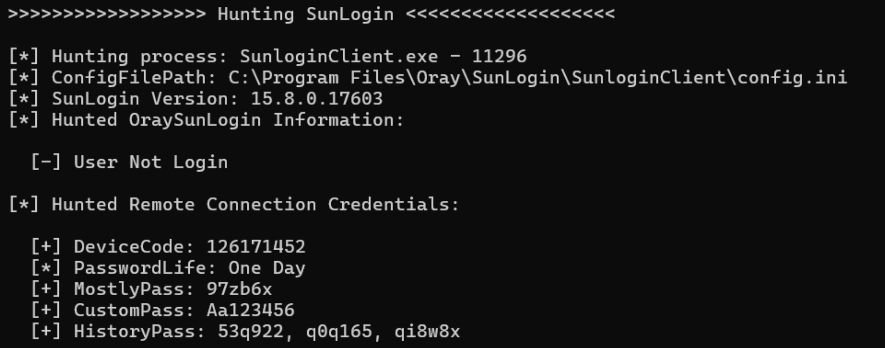

### Post Mode

#### 执行系统命令

不依赖 CMD 执行系统命令并回显（使用系统默认文本编码格式）

```shell
SharpHunter.exe run "ipconfig /all"
```


#### 添加管理员用户

```shell
SharpHunter.exe adduser LSTAR Aa123456
```


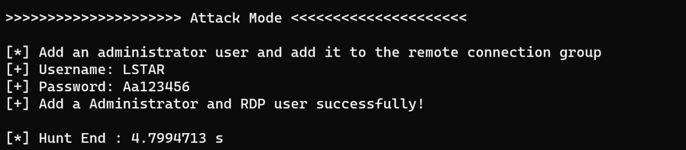

#### 开启 RDP

一键化开启 RDP 关闭防火墙并添加一个管理员用户用于连接

```shell
SharpHunter.exe enrdp
```

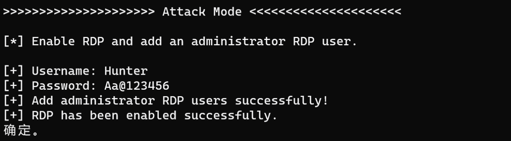

#### 多屏幕全尺寸截图

支持指定文件路径截图（无参数默认保存到用户图片目录）

```shell
SharpHunter.exe screen C:\Users\ACE\AppData\Roaming\Opera Software\Opera Stable\Opera
```

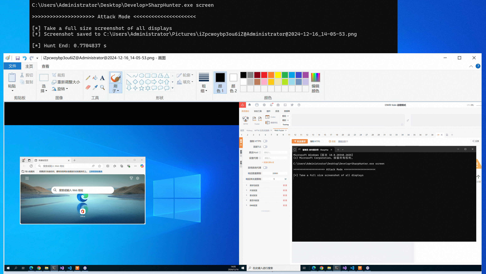

### Refrence

- https://xz.aliyun.com/t/15834
- https://github.com/williamknows/BOF.NET
- https://github.com/qwqdanchun/Pillager
- https://github.com/StarfireLab/SharpWeb
- https://github.com/Heart-Sky/ListRDPConnections

